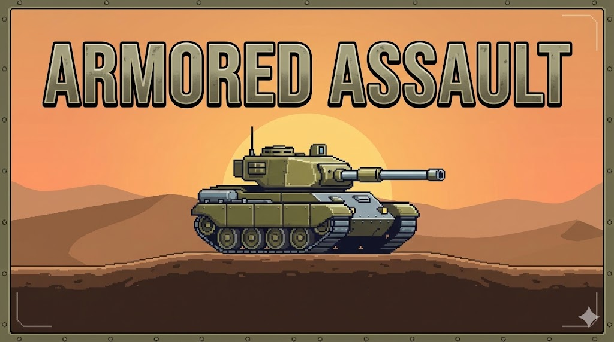

# *** GD4_CA1_DominikDomalip ***

## Armored Assault

- **Tactical Local Multiplayer Mayhem**
- Engage in high-stakes tank combat across 7 unique environments, from scorching deserts to treacherous underground bunkers. Choose from 4 specialized tank types, each with unique stats.
- **Controls**: Player1 WASD (Move) | L-SHIFT (Sprint) | SPACE (Fire)
                Player2 ARROWS (Move) | R-SHIFT (Sprint) | ENTER (Fire)
- **Tips**: 
        - Automated turret guards the center; dodge its fire to survive!
        - Watch your STAMINA bar; sprinting drains power quickly.
        - Scavenge battlefields for Health and Ammo refills to stay in the fight.
- **Objective**
Outmaneuver and outgun your opponent. The last tank standing wins!

## Client - Server Plan for CA2
- I will be working with the class code and making it specific for my kind of game with the needs I need, one example is I do not need scroll speed, my maps are static and I rather will need rotation of the tanks synced etc...

###### Network Protocol 
- My first step will be to introduce a common language for the Server an Client to communicate and basically agree on rules, which will be done by implementing a network protocol. 
- The protocol will define packet identifiers (as Enums) and data structures. Packet identifiers will be a list of unique IDs such as kPlayerEvent or kUpdateClientState. 
- They will be packed into sf::Packet. The main rule for the Packet is Data Sequencing which both Server and Client have to pack and unpack in the same order to prevent corruption of data.
- In my tank game the protocol will be designed to take care of syncing rotation and ammo level etc..to ensure the Client's HUD is reflected accurately to the Server's authorative values.

###### Game Server 
- Currently my World class takes care of everything such as drawing, handling collisions, inputs..For CA2 I will need to create a Game Server class which will be kind of the headless version of my current world, where it will be running all the logic of my current World class but without the textures, sounds and window.
- It will be managing my game's CommandQueue and instead of receiving commands from the local keyboard it will receive them as Packets from the Client and validate them, so to say for example check if this tank with this ID has enough stamina to dash, and apply them to the master state. This way we also prevent cheating because the Server has to validate the request. 
- In my current version of the game I am using 144fps, I will see with testing if it is possible to keep or if I need to lower it but basically the will implement a "heartbeat" that will gather state of all entities in the game every fps and broadcast the UpdateClientState packet to all player's (clients) making everybody synchronized and seeing the same screen.

###### Network Node
- Currently in my game the SceneNode is only for rendering but in the client server version of the game I will need something to allow me send "global" events which are not tied to a specific tank, so event like spawn pickup or fire turret. 
- For that I will have to introduce NetworkNode that will inherit from SceneNode and basically be a special SceneNode that sits at root of the graph and act like some kind of Mailbox.
- So when Server sends a command that isn't a direct player move, the NetworkNode will receive the Packet and convert it back into standard Command for SceneGraph to process locally.

###### Multiplayer Game State
- In the current version, my GameState handles both world and the local player, so I will need to implement Multiplayer Game State.
- Multiplayer Game State won't be polling the keyboard to move tank directly. Instead it will poll Socket to see what Server said and send Input Packet to the Server. 

###### How the Workflow will look
1. ##### Handshake and Initialization (TCP protocol) 
- Server will be ran on a local machine and Clients will connect to the Server's IP where Server will assign unique PlayerID and send InitialState packet.
- In my current game, I have options for the player's to choose tank type and map so this is where the Server tells the Client which map to load, which tank was selected. The Client then builds the local Scene Graph and waits for the start signal. 
- I will have to implement some logic to pick the final map, so something like random map from the selected which was draw, or selec the one with the most votes. 

2. ##### Client Input Capture (Client talking to the Server)
- In this case the termial becomes kind of standing still terminal for input.
- In the local current version of my game, the Player class pushes a commands to a local CommandQueue, in this case the Multiplayer Game State intercepts the keypresses.
- It will packet the action (such as Fire, RotateRight) into a kPlayerRealtimeChange packet and sends it to the Server.

3. ##### Server Processing and Authority 
- Server will be the only place where the physics happen. 
- Game Server receives input packets from all the Clients connected and pushes them into authorative (main and only) CommandQueue.
- It runs the World::Update logic (which is now headless, no drawing etc) and checks if tank is hitting obstacle, if it has enough stamina to use dash or if a turret has spotted a player.

4. ##### World Heartbeat (Server -> Client with UDP)
- Once the Server has updated everything, it broadcasts it to the clients connected.
- Every tick the Server sends a kUpdateClientState packet 
- This packet will contain the coordinates on the map x/y, rotations in degrees, current HP, ammo...for every tank and projectiles in the world.

5. ##### Local Reconciliation and Rendering (Client side, its job)
- At this point the Client receives the packet from Server and updates the visuals on its screen.
- The Network Node unpack the heartbeat and moves the tanks sprites to the coordinates Server provided.
- I will have to implement some kind of interpolation here because the network packets might arrive lower than my 144fps. It should smoothly slide the tanks from the old position to the new one rather than just teleport it there.

###### Protocols Comparison
1. TCP - Transmission Control Protocol - Reliability and Order
- This TCP ensures that every packet sent arrives exactly once and in the correct order, if a packet gets lost, TCP will stop and re sent the packet.
- This protocol will be used for important events where if we loose data it would break the game logic.
- Example would be assigning PLayer IDs and syncing the selected Map Types at the start of the game or sending Start Game state.

2. UDP - User Datagram Protocol - Speed and Unreliability
- UDP sends packets as fast as possible without checking if they arrived. No re-transimission like with TCP, which eliminates the lags caused by TCP waiting for lost data.
- This protocol will be used for the games heartbeat, data that changes so frequently that if we loose a packet, the next one arrives in a few milliseconds later and will render the old information anyway.
- Example would be movement and rotation, we will be sending constatnt updates of xy position and angles or projectiles positions flying over the map.

==============================================================================================================================================================================================================================

### REFERENCES 
- Freesound. (2025). Session Beat by Lit1onion. [online] Available at: https://freesound.org/people/Lit1onion/sounds/784081/ [Accessed 17 Feb. 2026].
- Freesound. (2018). Mushroom Background Music by Sunsai. [online] Available at: https://freesound.org/people/Sunsai/sounds/415804/ [Accessed 17 Feb. 2026]
- freesound.org. (n.d.). Freesound - Tank Firing by qubodup. [online] Available at: https://freesound.org/people/qubodup/sounds/168707/ [Accessed 17 Feb. 2026]
- Freesound. (2016). Sizzling boom by AceOfSpadesProduc100. [online] Available at: https://freesound.org/people/AceOfSpadesProduc100/sounds/340960/ [Accessed 17 Feb. 2026]
- Freesound. (2020). button-selected.wav by StavSounds. [online] Available at: https://freesound.org/people/StavSounds/sounds/546079/ [Accessed 17 Feb. 2026]
- Freesound. (2020). Select, Granted 04.wav by LilMati. [online] Available at: https://freesound.org/people/LilMati/sounds/515823/ [Accessed 17 Feb. 2026]
- Freesound. (2026). Bullet_Impact_2 by toxicwafflezz. [online] Available at: https://freesound.org/people/toxicwafflezz/sounds/150838/ [Accessed 17 Feb. 2026] 
- Freesound. (2023). Car Impact Hit, Shatter, No Glass by PNMCarrieRailfan. [online] Available at: https://freesound.org/people/PNMCarrieRailfan/sounds/681527/ [Accessed 17 Feb. 2026]
- Freesound. (2020). Powerup 04.wav by LilMati. [online] Available at: https://freesound.org/people/LilMati/sounds/503520/ [Accessed 17 Feb. 2026]
- Freesound. (2025). Smashed/demolished brick wall crumbling/caving in by Squirrel_404. [online] Available at: https://freesound.org/people/Squirrel_404/sounds/829103/ [Accessed 17 Feb. 2026]
- The Spriters Resource. (2026). Box Backgrounds - Pokémon Black / White - DS / DSi. [online] Available at: https://www.spriters-resource.com/ds_dsi/pokemonblackwhite/asset/34025/ [Accessed 17 Feb. 2026]
- itch.io. (n.d.). Stones & Brick Textures by Pucci Games. [online] Available at: https://pucci-games.itch.io/stones-brick-textures [Accessed 17 Feb. 2026]
- Pngegg.com. (2026). Free download | Computer hardware, Gun Turret, hardware, machine png | PNGEgg. [online] Available at: https://www.pngegg.com/en/png-tovsr/download [Accessed 17 Feb. 2026]#
- Moreira, Artur, Jan Haller, and Henrik Vogelius Hansson. SFML Game Development. Packt Publishing, 2013
- Gemini. (n.d.). Google Gemini picture generation. [online] Available at: https://gemini.google.com/app?hl=en_GB.
- Clipart Library (2026). Illustration. [online] Clipart-library.com. Available at: https://clipart-library.com/clip-art/49-495275_bullets-clipart-sprite-bullets-sprite.htm [Accessed 20 Feb. 2026].
- Freesound. (2022). TF_movie_Optimus_inspired_laser_sound_effect_01_2022 by Artninja. [online] Available at: https://freesound.org/people/Artninja/sounds/784935/ [Accessed 20 Feb. 2026].
- Freesound. (2016). Launching 1 by AceOfSpadesProduc100. [online] Available at: https://freesound.org/people/AceOfSpadesProduc100/sounds/334268/ [Accessed 20 Feb. 2026].
